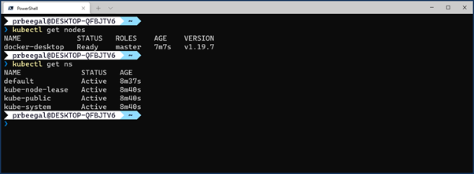

# AzurePaaSAnywhere
Azure now has released the capability to run Azure Application Services to run anywhere which are Arc enabled. 

# STEPS TO RUN AZURE APPLICATION SERVICES ON YOUR LAPTOP OR OTHER HOME DEVICES

# Step 1 – Enable K8S on your laptop, and connect it to Azure using Arc

There are multiple ways on running Kubernetes locally on your laptop (miniKube, Kind etc), I have chosen the option of using Docker Desktop. If you have Docker desktop running, you can enable Kubernetes in the settings:


Now, using Windows terminal or Powershell if you can get to the correct cluster context and run the following commands to see everything is it should be.



I found this resource useful which takes you through how to connect your cluster to Azure Arc - Existing cluster | Azure Arc Jumpstart

To connect this docker-desktop to Azure Arc, create a resource group (or use an existing one) and then the command to connect.
```
az group create -n arccluster1345 -l westeurope

az connectedk8s connect --name arcpblaptop1506 --resource-group arccluster1506
```


Now that your laptop is connected to Azure Arc, you can see the following pods running in your laptop cluster 


You can explore the resource group arccluster1345 in the portal where you can see an Azure Arc Cluster. 


# Step 2 – Install the App Service extension to your docker desktop cluster

Now that your laptop cluster is connected, you can install an App Service extension as shown here:


You have a field to enter your static ip as shown below. I don’t have any static IP’s (there are service providers who can set up and manage static ip’s dedicated for you, which are not free as far as I know).
I have used my router’s public ip which you can find using whatismyip.com  (ipv4). However taking this approach will mean that, you need to do port forwarding on ports 80, 443 and 8081 as well as open the OS firewall to these 3 ports. Refer appendix to see more detail and screen shots from port forwarding. 


Defaulting on the Monitoring and Tags tabs will take you to the screen shown here. It presents you with a series of commands to push the extension to your laptop cluster. Copy the commands, and run one by one in sequence. Screen shots should provide you guidance. (Note that there are some steps to be taken after you run the first few commands, and before you run the create custom location command – so follow through the screen shots)


Now that you have pushed the extension successfully to your docker desktop cluster, check all the pods, namespaces and services.


Before you run custom location create, you need to do the following:
As you see the highlighted envoy service, it doesn’t have an external-ip. You need to edit this service file to add the external ip (which is the same as what you found in whatismyip.com)
Kubectl edit svc -n appservice-ns paas1506-k8se-envoy


Now you can see the external ip as highlighted below:


# Persistent Volume and Persistent volume claim
When you run get pods, you should see a build-service pod in pending state.


If you describe pod on this one, it will show you why it is in pending state (unbound persistent volume claims)


To get this POD out of pending state, we need to create a Persistent volume followed by claiming that storage using Persistent volume claim (PVC)
#Create a Persistent volume – edit the highlight to match it with your name and namespace

cat <<EOF | kubectl apply -f -
apiVersion: v1
kind: PersistentVolume
metadata:
  name: paas1506-k8se-build-service
  labels:
    type: local
spec:
  storageClassName: default
  capacity:
    storage: 100Gi
  accessModes:
    - ReadWriteOnce
  hostPath:
    path: "/mnt/data"
EOF

#Create a Persistent volume claim
cat <<EOF | kubectl apply -f -
apiVersion: v1
kind: PersistentVolumeClaim
metadata:
  name: paas1506-k8se-build-service
  namespace: appservice-ns
spec:
  storageClassName: default
  accessModes:
    - ReadWriteOnce
  resources:
    requests:
      storage: 100Gi
EOF


Now that you have made a claim to Persistent volume, the pod which was pending should get back to running state.


You can now go ahead and finish the remainder of the scripts – which is to create a custom location and create a app service Kubernetes environment.


When they are successful, you can go and see the following resources in the resource group


To test this, we can go and create a AppService – like you normally do in the portal, and select region as whatever you created (mine was prakashlondon). This should deploy this node.js starter webapp to your docker desktop k8s cluster, which you can browse through.

# Step 3 – Create webapp to deploy to Docker desktop cluster

In Azure Portal, create a web app


# Appendix:

PORT FORWARDING
The screen shot is from my router settings where I did the port forwarding. Your routers port forwarding page might look different.


